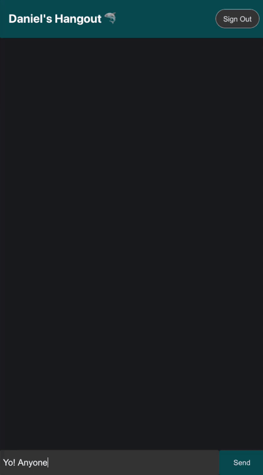

# Full-Stack React Live Messaging with Google Firebase
A full-stack real-time messaging application I developed using React for the front-end and Google Firebase for the back-end database. This application supports live server-side message updates and I've also implemented Google Sign-In for easy user authentication/sign-up. This is currently live; come try it out @ chat.danielhuynh.co!
## Demo of Application

### Google Authentication
